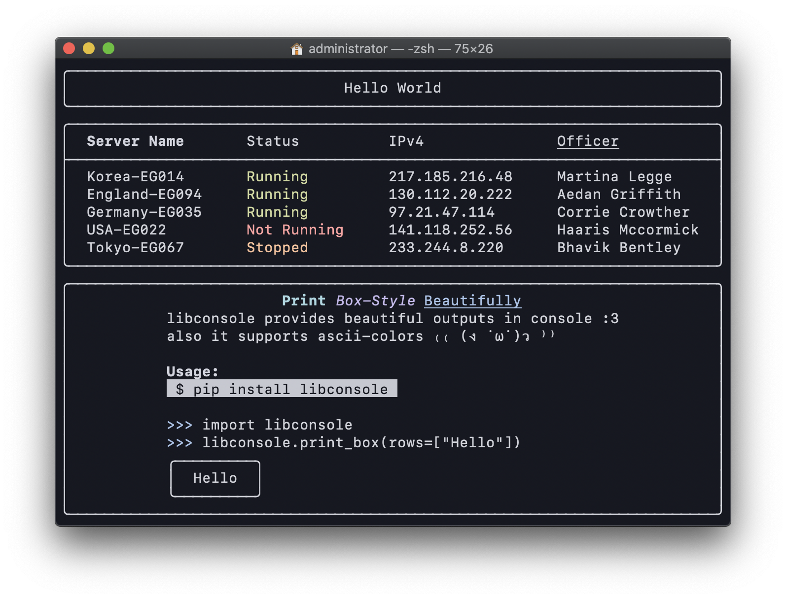

<div style="text-align:center"></div>

# libconsole
✨ Beautiful printouts in Python

# Usage

Install:

```
pip install libconsole
```

Example:

```python
>>> import libconsole
>>> libconsole.print_box(rows=["Hello"])
╭─────────╮
│  Hello  │
╰─────────╯
```

# Todo

- Support for align centering
- Support for emoji
